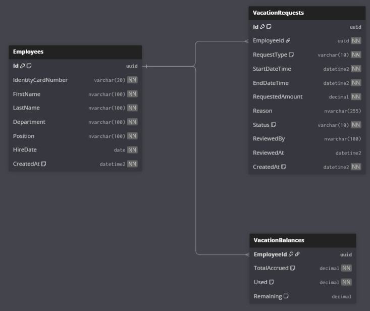

# Workers Vacation Management API

A comprehensive API for managing worker vacations built with TypeScript, Node.js, and clean architecture principles.

## Architecture

This project follows Clean Architecture with three main layers:

### 1. Domain Layer (`src/domain/`)
- **Entities**: Core business objects (Worker, VacationRequest)
- **Value Objects**: Immutable objects representing domain concepts
- **Repositories**: Interfaces defining data access contracts
- **Services**: Domain business logic (VacationCalculationService)

### 2. Application Layer (`src/application/`)
- **Use Cases**: Application business logic and orchestration
- **Dependency Injection**: InversifyJS container configuration
- **DTOs**: Request/Response data transfer objects

### 3. Infrastructure Layer (`src/infrastructure/`)
- **Repositories**: Concrete implementations of domain repositories
- **Database**: SQLite database setup and management
- **External Services**: Third-party integrations

### 4. Presentation Layer (`src/presentation/`)
- **Controllers**: HTTP request handlers
- **Routes**: API endpoint definitions
- **Middleware**: Request processing and validation

## Features

### Worker Management
- Create workers with unique codes and cedulas
- Retrieve worker information
- Calculate seniority years automatically
- Validate worker data integrity

### Vacation Request Management
- Create vacation requests (days or hours)
- Approve/reject requests by administrators
- Track request status (pending, approved, rejected)
- Validate vacation availability

### Vacation Balance Calculation
- Calculate available vacation days based on seniority
- Track used and pending vacation days
- Prevent over-allocation of vacation time
- Support both daily and hourly vacation requests

## Installation

```bash
# Install dependencies
npm install

# Build the project
npm run build

# Start development server
npm run dev

# Start production server
npm start
```

## Vacation Calculation Rules

- **Base vacation days**: 15 days per year
- **Seniority bonus**: +1 day per year of service
- **Maximum vacation days**: 30 days per year
- **Hours calculation**: 8 hours = 1 day

## Database Schema



## Development

### Scripts
- `npm run dev`: Start development server with hot reload
- `npm run build`: Build TypeScript to JavaScript
- `npm start`: Start production server
- `npm test`: Run tests
- `npm run lint`: Run ESLint
- `npm run lint:fix`: Fix ESLint errors

### Project Structure
```
src/
├── domain/
│   ├── entities/
│   ├── value-objects/
│   ├── repositories/
│   └── services/
├── application/
│   ├── use-cases/
│   └── di/
├── infrastructure/
│   ├── database/
│   └── repositories/
└── presentation/
    └── controllers/
```

## Technologies Used

- **TypeScript**: Type-safe JavaScript
- **Node.js**: Runtime environment
- **Express**: Web framework
- **SQLite**: Database
- **InversifyJS**: Dependency injection
- **Helmet**: Security middleware
- **CORS**: Cross-origin resource sharing
- **Morgan**: HTTP request logger

## Design Patterns

- **Clean Architecture**: Separation of concerns
- **Repository Pattern**: Data access abstraction
- **Dependency Injection**: Loose coupling
- **Value Objects**: Immutable domain concepts
- **Use Case Pattern**: Application business logic
- **Controller Pattern**: HTTP request handling

## Error Handling

The API provides comprehensive error handling:
- Input validation errors (400)
- Resource not found errors (404)
- Business rule violations (400)
- Internal server errors (500)

## Security

- Input validation and sanitization
- SQL injection prevention
- CORS configuration
- Security headers (Helmet)
- Request logging
